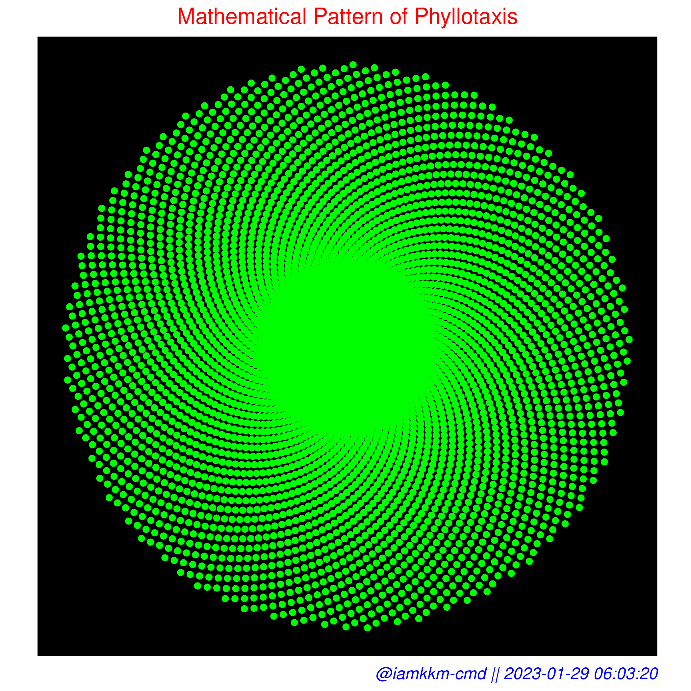

<!-- <div class="warning" style='padding:0.1em; text-align: center; background-color:#E9D8FD; color:#FC0362; border-left: solid #805AD5 30px; border-right: solid #805AD5 30px; border-radius: 30%'>
<span>
<p style='margin-top:1em; text-align:center'>
<b><a style='font-size:20px;' href='https://iamkkm-cmd.shinyapps.io/BeautyOfNature/'>Visit the Shiny Web App</a></b></p>
<a style='color:#fc0362; font-size:15px;' href='https://iamkkm-cmd.shinyapps.io/BeautyOfNature/'>https://iamkkm-cmd.shinyapps.io/BeautyOfNature/</a>
</p></span>
</div> -->

>  **Visit:** [**https://iamkkm-cmd.shinyapps.io/BeautyOfNature/**](https://iamkkm-cmd.shinyapps.io/BeautyOfNature/)

## About
- Title: **Beauty of Nature: Phyllotaxis**
- Credit: [Krishnakanta Maity](https://github.com/iamkkmcmd) 
- Time Span: **Jan - May, 2020**
- Method Used: **EDA, Difference in Difference Regression, Panel data regression, DID panel data regression**
- Programming Language: R, Python
- Technology: Jupyter Notebook, R Studio, Latex
- Dependency: Mention in initial part of the [global.R](global.R).


## :ledger: Content

- [About](#about)
- [:ledger: Content](#ledger-content)
- [:beginner: Introduction](#beginner-introduction)
- [:file\_folder: File Structure](#file_folder-file-structure)
- [How to use?](#how-to-use)
- [Example](#example)

##  :beginner: Introduction
Phyllotaxis, the arrangement of leaves on a stem, is a fascinating aspect of plant growth and development. In this project, we will be studying the phyllotaxy pattern and presenting our findings through a Shiny web application. The application will generate simulated data to demonstrate the principles of phyllotaxis and the Fibonacci sequence that underlies it. The project aims to provide a unique and interactive way of understanding this complex natural phenomenon. 


##  :file_folder: File Structure
- **Data Source**: Simulated data

File structure of the project folder is given below. Fine names are self explanatory.

```
.
├── img
├── www
├── global.R
├── server.R
├── ui.R
└── README.md
```
## How to use?
Look at navbar pane, **under navbar there are three tabs viz. about, plot and data**. In the sidebar pane there are sliders for different input options. Also you can download plot (png format) and data (CSV format).

## Example

<div class="warning" style='padding:0.1em; background-color:#E9D8FD; color:#69337A'>
<span>
<p style='margin-top:1em; text-align:center'>




</p></span>
</div>