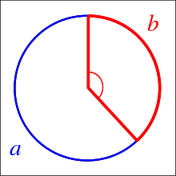

## Idea
A spiral is a curve which starts from the origin and moves away from the origin as it revolves around it. A simple way to arrange them in a spiral is to multiply x and y coordinates by a factor which increases for each point.

## Mathematics
Let $a+b$ be the circumference of a circle, divided into a longer arc of length $a$ and a smaller arc of length $b$ such that

$$\frac{a+b}{a} = \frac{a}{b}$$
The golden angle is the angle subtended by the smaller (red) arc when two arcs that make up a circle are in the golden ratio.

    

Golden ratio is $\varphi = \frac{a}{b}$. 
Let $f$ be the fraction of the circumference subtended by the golden angle, or equivalently, the golden angle divided by the angular measurement of the circle.

$$ f={\frac {b}{a+b}}={\frac {1}{1+\varphi }}$$

But since

$$1+\varphi=\varphi ^{2}$$
it follows that $f = \frac{1}{\varphi^2}$. This is equivalent to saying that $\varphi^2$ golden angles can fit in a circle.
$$Golden \ Ratio =\frac{(1+\sqrt{5})}{2} $$
$$Golden \ Angle =\frac{2\pi}{\varphi^2} = \pi (3-\sqrt{5})$$

## Algorithm
- Take a sequence of natural numbers.
- Set up an angle of the form $\pi(a-\sqrt{b})$.
- Make a series of numbers by multiply angle with corresponding points in *step-1*. Let it be denoted by $t$.
- Transformation: $X = t \times sin(t)$ and $Y = t \times cos(t)$.
- Finally plot $x$ and $y$.

## Instructions
- Choose the value of $a$ and $b$.
- Select the number of points $n$.
- Also play with plotting character type, size and colours.